#Microservices

##Monolithic

Monolithic applications force multiple development teams to artificially synchronize their delivery
because their code needs to be built, tested, and deployed as an entire unit.
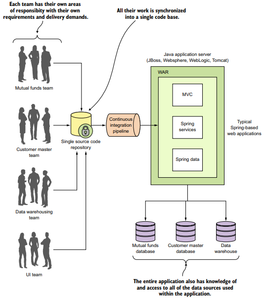

##Microservices

Using a microservice architecture our CRM application would be decomposed into a set
of microservices completely independent of each other, allowing each development team to move at
their own pace.
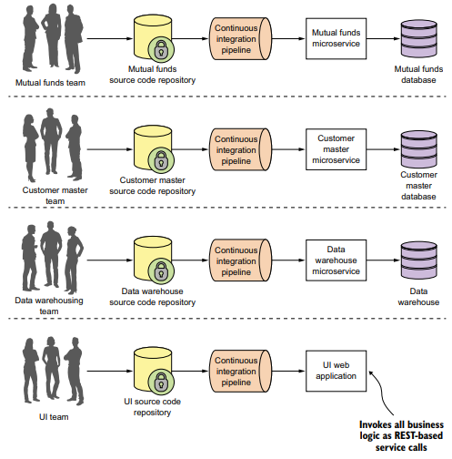

 you can see that each functional team completely owns their
service code and service infrastructure. They can build, deploy, and test independently of each other because their code, source control repository, and the infrastructure (app server and database) are now completely independent of the other parts of
the application.

A microservice architecture has the following characteristics:
*   Application logic is broken down into small-grained components with welldefined boundaries of responsibility that coordinate to deliver a solution.
*   Each component has a small domain of responsibility and is deployed completely independently of one another. Microservices should have responsibility
for a single part of a business domain. Also, a microservice should be reusable
across multiple applications.
*   Microservices communicate based on a few basic principles (notice I said principles, not standards) and employ lightweight communication protocols such as
HTTP and JSON (JavaScript Object Notation) for exchanging data between the
service consumer and service provider.
*   The underlying technical implementation of the service is irrelevant because
the applications always communicate with a technology-neutral protocol (JSON
is the most common). This means an application built using a microservice
application could be built with multiple languages and technologies.
*   Microservices—by their small, independent, and distributed nature—allow
organizations to have small development teams with well-defined areas of
responsibility. These teams might work toward a single goal such as delivering
an application, but each team is responsible only for the services on which
they’re working.

##What exactly is the cloud

The Spring Cloud framework makes it simple to operationalize and
deploy microservices to a private or public cloud. Spring Cloud wraps several popular
cloud-management microservice frameworks under a common framework and makes
the use and deployment of these technologies as easy to use as annotating your code. I
cover the different components within Spring Cloud later in this chapter. 

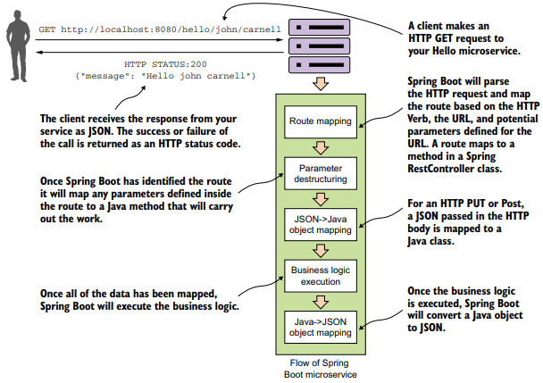

Spring Boot abstracts away the common REST microservice task (routing to business logic, parsing
HTTP parameters from the URL, mapping JSON to/from Java Objects), and lets the developer focus on the business
logic for the service.

The term “cloud” has become overused. Every software vendor has a cloud and everyone’s platform is cloud-enabled, but if you cut through the hype, three basic models
exist in cloud-based computing. These are
*   Infrastructure as a Service (IaaS)
*   Platform as a Service (PaaS)
*   Software as a Service (SaaS)

To better understand these concepts, let’s map the everyday task of making a meal to
the different models of cloud computing. When you want to eat a meal, you have four
choices:
1   You can make the meal at home.
2   
You can go to the grocery store and buy a meal pre-made that you heat up and
serve.
3 You can get a meal delivered to your house.
4 You can get in the car and eat at restaurant

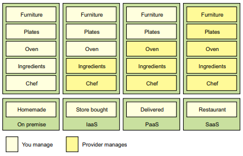

The difference between these options is about who’s responsible for cooking these
meals and where the meal is going to be cooked. In the on-premise model, eating a
meal at home requires you to do all the work, using your own oven and ingredients
already in the home. A store-bought meal is like using the Infrastructure as a Service
(IaaS) model of computing. You’re using the store’s chef and oven to pre-bake the
meal, but you’re still responsible for heating the meal and eating it at the house (and
cleaning up the dishes afterward).
In a Platform as a Service (PaaS) model you still have responsibility for the meal,
but you further rely on a vendor to take care of the core tasks associated with making
a meal. For example, in a PaaS model, you supply the plates and furniture, but the restaurant owner provides the oven, ingredients, and the chef to cook them. In the Software as a Service (SaaS) model, you go to a restaurant where all the food is prepared
for you. You eat at the restaurant and then you pay for the meal when you’re done.
you also have no dishes to prepare or wash.
The key items at play in each of these models are ones of control: who’s responsible for maintaining the infrastructure and what are the technology choices available
for building the application? In a IaaS model, the cloud vendor provides the basic
infrastructure, but you’re accountable for selecting the technology and building the
final solution. On the other end of the spectrum, with a SaaS model, you’re a passive
consumer of the service provided by the vendor and have no input on the technology
selection or any accountability to maintain the infrastructure for the application.

Emerging cloud platforms
I’ve documented the three core cloud platform types (IaaS, PaaS, SaaS) that are in
use today. However, new cloud platform types are emerging. These new platforms
include Functions as a Service (FaaS) and Container as a Service (CaaS). FaaS-based
(https://en.wikipedia.org/wiki/Function_as_a_Service) applications use technologies like Amazon’s Lambda technologies and Google Cloud functions to build applications deployed as “serverless” chunks of code that run completely on the cloud
provider’s platform computing infrastructure. With a FaaS platform, you don’t have to
manage any server infrastructure and only pay for the computing cycles required to
execute the function.
With the Container as a Service (CaaS) model, developers build and deploy their
microservices as portable virtual containers (such as Docker) to a cloud provider.
Unlike an IaaS model, where you the developer have to manage the virtual machine
the service is deployed to, with CaaS you’re deploying your services in a lightweight
virtual container. The cloud provider runs the virtual server the container is running
on as well as the provider’s comprehensive tools for building, deploying, monitoring,
and scaling containers. Amazon’s Elastic Container Service (ECS) is an example of a
CaaS-based platform. In chapter 10 of this book, we’ll see how to deploy the
microservices you’ve built to Amazon ECS.
It’s important to note that with both the FaaS and CaaS models of cloud computing,
you can still build a microservice-based architecture. Remember, the concept of
microservices revolves around building small services, with limited responsibility,
using an HTTP-based interface to communicate. The emerging cloud computing platforms, such as FaaS and CaaS, are really about alternative infrastructure mechanisms for deploying microservices.

As a developer writing a microservice, sooner or later you’re going to have to
decide whether your service is going to be deployed to one of the following:
*   Physical server—While you can build and deploy your microservices to a physical machine(s), few organizations do this because physical servers are constrained. You can’t quickly ramp up the capacity of a physical server and it can
become extremely costly to scale your microservice horizontally across multiple
physical servers.
*   Virtual machine images—One of the key benefits of microservices is their ability
to quickly start up and shut down microservice instances in response to scalability and service failure events. Virtual machines are the heart and soul of the
Emerging cloud platforms
I’ve documented the three core cloud platform types (IaaS, PaaS, SaaS) that are in
use today. However, new cloud platform types are emerging. These new platforms
include Functions as a Service (FaaS) and Container as a Service (CaaS). FaaS-based
(https://en.wikipedia.org/wiki/Function_as_a_Service) applications use technologies like Amazon’s Lambda technologies and Google Cloud functions to build applications deployed as “serverless” chunks of code that run completely on the cloud
provider’s platform computing infrastructure. With a FaaS platform, you don’t have to
manage any server infrastructure and only pay for the computing cycles required to
execute the function.
With the Container as a Service (CaaS) model, developers build and deploy their
microservices as portable virtual containers (such as Docker) to a cloud provider.
Unlike an IaaS model, where you the developer have to manage the virtual machine
the service is deployed to, with CaaS you’re deploying your services in a lightweight
virtual container. The cloud provider runs the virtual server the container is running
on as well as the provider’s comprehensive tools for building, deploying, monitoring,
and scaling containers. Amazon’s Elastic Container Service (ECS) is an example of a
CaaS-based platform. In chapter 10 of this book, we’ll see how to deploy the
microservices you’ve built to Amazon ECS.
It’s important to note that with both the FaaS and CaaS models of cloud computing,
you can still build a microservice-based architecture. Remember, the concept of
microservices revolves around building small services, with limited responsibility,
using an HTTP-based interface to communicate. The emerging cloud computing platforms, such as FaaS and CaaS, are really about alternative infrastructure mechanisms for deploying microservices.
Licensed to <null>
16 CHAPTER 1 Welcome to the cloud, Spring
major cloud providers. A microservice can be packaged up in a virtual machine
image and multiple instances of the service can then be quickly deployed and
started in either a IaaS private or public cloud.
*   Virtual container—Virtual containers are a natural extension of deploying your
microservices on a virtual machine image. Rather than deploying a service to a
full virtual machine, many developers deploy their services as Docker containers (or equivalent container technology) to the cloud. Virtual containers run
inside a virtual machine; using a virtual container, you can segregate a single virtual machine into a series of self-contained processes that share the same virtual
machine image.

Why not PaaS-based microservices?
Earlier in the chapter we discussed three types of cloud platforms (Infrastructure as
a Service, Platform as a Service, and Software as a Services). For this book, I’ve chosen to focus specifically on building microservices using an IaaS-based approach.
While certain cloud providers will let you abstract away the deployment infrastructure
for your microservice, I’ve chosen to remain vendor-independent and deploy all parts
of my application (including the servers).
For instance, Amazon, Cloud Foundry, and Heroku give you the ability to deploy your
services without having to know about the underlying application container. They provide a web interface and APIs to allow you to deploy your application as a WAR or JAR
file. Setting up and tuning the application server and the corresponding Java container are abstracted away from you. While this is convenient, each cloud provider’s
platform has different idiosyncrasies related to its individual PaaS solution.
An IaaS approach, while more work, is portable across multiple cloud providers and
allows us to reach a wider audience with our material. Personally, I’ve found that
PaaS-based cloud solutions can allow you to quickly jump start your development
effort, but once your application reaches enough microservices, you start to need the
flexibility the IaaS style of cloud development provides.
Earlier in the chapter, I mentioned new cloud computing platforms such as Function
as a Service (FaaS) and Container as a Service (CaaS). If you’re not careful, FaaSbased platforms can lock your code into a cloud vendor platform because your code
is deployed to a vendor-specific runtime engine. With a FaaS-based model, you might
be writing your service using a general programming language (Java, Python, JavaScript, and so on), but you’re still tying yourself heavily to the underlying vendor APIs
and runtime engine that your function will be deployed to. 

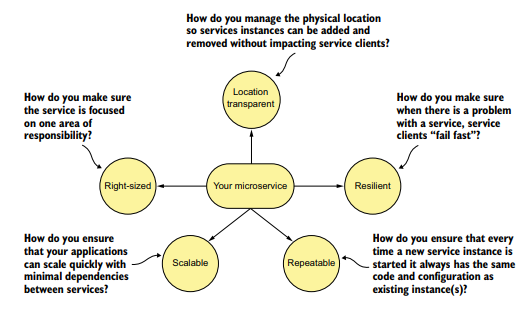

*   Right-sized—How do you ensure that your microservices are properly sized so
that you don’t have a microservice take on too much responsibility? Remember,
properly sized, a service allows you to quickly make changes to an application
and reduces the overall risk of an outage to the entire application.
*   Location transparent—How you we manage the physical details of service invocation when in a microservice application, multiple service instances can quickly
start and shut down?
*   Resilient—How do you protect your microservice consumers and the overall
integrity of your application by routing around failing services and ensuring
that you take a “fail-fast” approach?
*   Repeatable—How do you ensure that every new instance of your service brought
up is guaranteed to have the same configuration and code base as all the other
service instances in production?
*   Scalable—How do you use asynchronous processing and events to minimize the
direct dependencies between your services and ensure that you can gracefully
scale your microservices?
    
##Core microservice development pattern

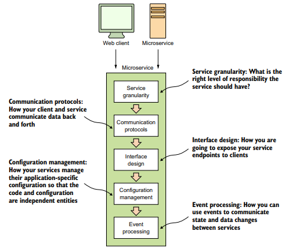

*   Service granularity — how do you approach decomposing a business domain
down into microservices so that each microservice has the right level of responsibility? Making a service too coarse-grained with responsibilities that overlap
into different business problems domains makes the service difficult to maintain and change over time. Making the service too fine-grained increases the
overall complexity of the application and turns the service into a “dumb” data
abstraction layer with no logic except for that needed to access the data store. 
*   Communication protocols—how will developers communicate with your service?
Do you use XML (Extensible Markup Language), JSON (JavaScript Object Notation), or a binary protocol such as Thrift to send data back and forth your
microservices? 
*   Interface design—What’s the best way to design the actual service interfaces that
developers are going to use to call your service? How do you structure your service URLs to communicate service intent? What about versioning your services?
A well-design microservice interface makes using your service intuitive.
*   Configuration management of service — how do you manage the configuration of
your microservice so that as it moves between different environments in the
cloud you never have to change the core application code or configuration?
*   Event processing between services—How do you decouple your microservice using
events so that you minimize hardcoded dependencies between your services
and increase the resiliency of your application? 

##Microservice routing patterns

The microservice routing patterns deal with how a client application that wants to
consume a microservice discovers the location of the service and is routed over to it.
In a cloud-based application, you might have hundreds of microservice instances running. You’ll need to abstract away the physical IP address of these services and have a
single point of entry for service calls so that you can consistently enforce security and
content policies for all service calls.

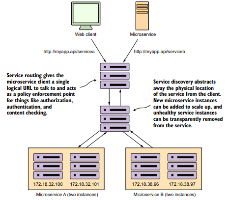

*   Service discovery—How do you make your microservice discoverable so client
applications can find them without having the location of the service hardcoded into the application? How do you ensure that misbehaving microservice
instances are removed from the pool of available service instances?
*   Service routing—How do you provide a single entry point for all of your services so 
that security policies and routing rules are applied uniformly to multiple services 
and service instances in your microservice applications? How do you ensure that 
each developer in your team doesn’t have to come up with their own solutions for 
providing routing to their services? 

service discovery and service routing appear to have a hard-coded
sequence of events between them (first comes service routing and the service discovery). However, the two patterns aren’t dependent on one another. For instance, we
can implement service discovery without service routing. You can implement service
routing without service discovery (even though its implementation is more difficult).

##Microservice client resiliency patterns
Because microservice architectures are highly distributed, you have to be extremely
sensitive in how you prevent a problem in a single service (or service instance) from
cascading up and out to the consumers of the service. To this end, we’ll cover four client resiliency patterns:

*   Client-side load balancing—How do you cache the location of your service
instances on the service client so that calls to multiple instances of a microservice are load balanced to all the health instances of that microservice?
*   Circuit breakers pattern—How do you prevent a client from continuing to call a
service that’s failing or suffering performance problems? When a service is running slowly, it consumes resources on the client calling it. You want failing
microservice calls to fail fast so that the calling client can quickly respond and
take an appropriate action.
*   Fallback pattern—When a service call fails, how do you provide a “plug-in” mechanism that will allow the service client to try to carry out its work through alternative means other than the microservice being called?
*   Bulkhead pattern—Microservice applications use multiple distributed resources
to carry out their work. How do you compartmentalize these calls so that the misbehavior of one service call doesn’t negatively impact the rest of the application?
    
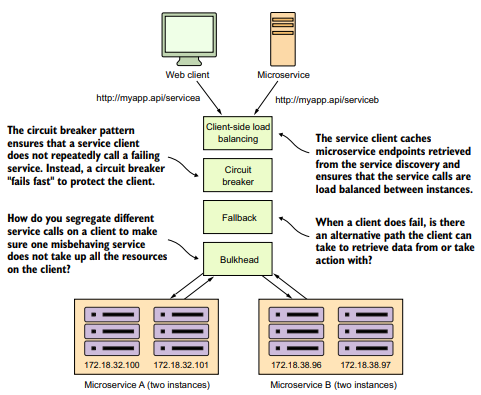

With microservices, you must protect the service caller from a poorly behaving service.
Remember, a slow or down service can cause disruptions beyond the immediate service.

##Microservice security patterns

*   Authentication—How do you determine the service client calling the service is
who they say they are?
*   Authorization—How do you determine whether the service client calling a
microservice is allowed to undertake the action they’re trying to undertake?
*   Credential management and propagation—How do you prevent a service client from
constantly having to present their credentials for service calls involved in a transaction? Specifically, we’ll look at how token-based security standards such as
OAuth2 and JavaScript Web Tokens (JWT) can be used to obtain a token that can
be passed from service call to service call to authenticate and authorize the user
    
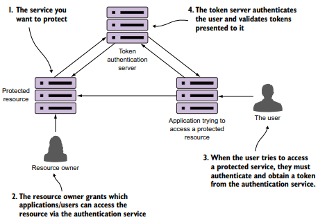

Using a token-based security scheme, you can implement service authentication and
authorization without passing around client credentials

##Microservice logging and tracing patterns

The beauty of the microservice architecture is that a monolithic application is broken
down into small pieces of functionality that can be deployed independently of one
another. The downside of a microservice architecture is that it’s much more difficult
to debug and trace what the heck is going on within your application and services.

*   Log correlation—How do you tie together all the logs produced between services
for a single user transaction? With this pattern, we’ll look at how to implement a
correlation ID, which is a unique identifier that will be carried across all service
calls in a transaction and can be used to tie together log entries produced from
each service.
*   Log aggregation—With this pattern we’ll look at how to pull together all of the
logs produced by your microservices (and their individual instances) into a single queryable database. We’ll also look at how to use correlation IDs to assist in
searching your aggregated logs.
*   Microservice tracing—Finally, we’ll explore how to visualize the flow of a client
transaction across all the services involved and understand the performance
characteristics of services involved in the transaction.
    
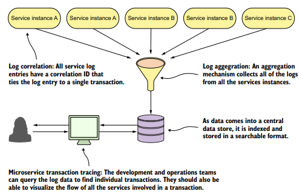

##Microservice build/deployment patterns

One of the core parts of a microservice architecture is that each instance of a
microservice should be identical to all its other instances. You can’t allow “configuration drift” (something changes on a server after it’s been deployed) to occur, because
this can introduce instability in your applications.

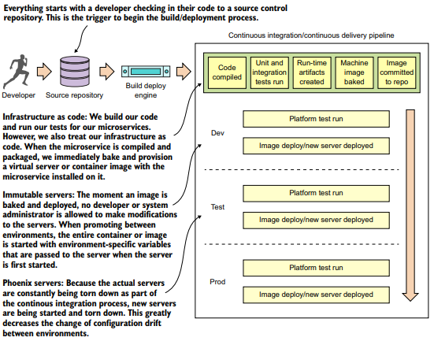

##Using Spring Cloud in building your microservices

Spring Cloud wraps the work of open source companies such as Pivotal,
HashiCorp, and Netflix in delivering patterns. Spring Cloud simplifies setting up and
configuring of these projects into your Spring application so that you can focus on
writing code, not getting buried in the details of configuring all the infrastructure that
can go with building and deploying a microservice application.

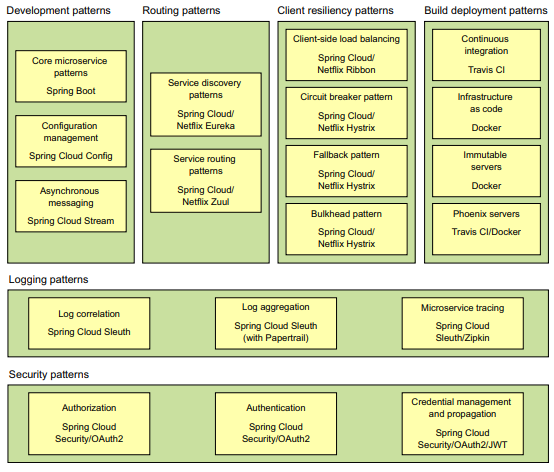
