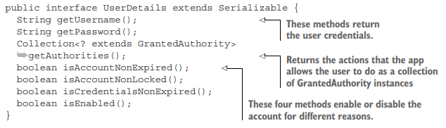

#Spring Security


*   The authentication filter delegates the authentication request to the authentication manager and, based on the response, configures the security context.
*   The authentication manager uses the authentication provider to process
authentication.
*   The authentication provider implements the authentication logic.
*   The user details service implements user management responsibility, which the
authentication provider uses in the authentication logic.
*   The password encoder implements password management, which the authentication provider uses in the authentication logic.
*   The security context keeps the authentication data after the authentication
process.

##UserDetailsService, PasswordEncoder

The authentication provider uses UserDetailsService, PasswordEncoder to find users and to check their passwords. Let’s start with the way you provide the
needed credentials for authentication. An object that implements a UserDetailsService contract with Spring Security manages the details about users. Until now, we used the default implementation provided by Spring Boot.


The PasswordEncoder does two things:
*   Encodes a password 
*   Verifies if the password matches an existing encoding

PasswordEncoder exists together with the default UserDetailsService. When we replace the default implementation of the UserDetailsService, we must also specify a PasswordEncoder

There is multiple ways to override a configuration. This flexibility can create confusion. Mix
of different styles of configuring different parts of Spring Security in the same application is undesirable. 
So this flexibility comes with a caution. In some cases, developers choose to use beans in the Spring context for
the configuration. In other cases, they override various methods for the same purpose. The
speed with which the Spring ecosystem evolved is probably one of the main factors
that generated these multiple approaches. Configuring a project with a mix of styles is
not desirable as it makes the code difficult to understand and affects the maintainability of the application. Knowing your options and how to use them is a valuable skill,
and it helps you better understand how you should configure application-level security in a project. UserDetailsService and a
PasswordEncoder two components take part in authentication, and most applications customize them depending on their requirements.


InMemoryUserDetailsManager this implementation stores credentials in memory, which can then be used by Spring Security to
authenticate a request.


```
@Configuration                          <---------The @Configuration
public class ProjectConfig {                       annotation marks the class               The @Bean annotation instructs
                                                   as a configuration class.                Spring to add the returned value
 @Bean                                                                       <------------  as a bean in the Spring context.
      
 public UserDetailsService userDetailsService() {
 var userDetailsService = new InMemoryUserDetailsManager();                 <------------- The var word makes the syntax
                                                                                           shorter and hides some details.
 return userDetailsService;
 }
}
```

. If execute the code exactly as it is now, you’ll no longer see the autogenerated password in the console. The application now uses the instance of type UserDetailsService you added
to the context instead of the default autoconfigured one. But, at the same time, you won’t be able to access the endpoint anymore for two reasons:
*   You don’t have any users.
*   You don’t have a PasswordEncoder

```
@Configuration
public class ProjectConfig {
 @Bean
 public UserDetailsService userDetailsService() {
 var userDetailsService = new InMemoryUserDetailsManager();
 
 var user = User.withUsername("john")               | Builds the user with a
 .password("12345")                                 | given username, password,    
 .authorities("read")                               | and authorities list
 .build();

 userDetailsService.createUser(user);    <----------| Adds the user to be managed
 return userDetailsService;                         | by UserDetailsService      
 }
}
```

Sometimes we’d like to change it to match our application. Similarly, not all endpoints of an application need to be secured, and for those
that do, we might need to choose different authorization rules. To make such changes, we start by extending the WebSecurityConfigurerAdapter 
class. Extending this class allows us to override the configure(HttpSecurity http) method as:

```
@Configuration
public class ProjectConfig
 extends WebSecurityConfigurerAdapter {
 // Omitted code
 @Override
 protected void configure(HttpSecurity http) throws Exception {
    http.httpBasic();
    http.authorizeRequests()                   
        .anyRequest()
        //All the requests require authentication.
        .authenticated();         
 }
}
```
One of the confusing aspects of creating configurations with Spring Security is having
multiple ways to configure the same thing. In the configuration class, instead of defining these two objects as beans, we set
them up through the configure(AuthenticationManagerBuilder auth) method. We override this method from the WebSecurityConfigurerAdapter class
and use its parameter of type AuthenticationManagerBuilder to set both the UserDetailsService and the PasswordEncoder

```
@Configuration
public class ProjectConfig extends WebSecurityConfigurerAdapter {
 
 @Override
 protected void configure(AuthenticationManagerBuilder auth) throws Exception {
    var userDetailsService = new InMemoryUserDetailsManager();
    
    var user = User.withUsername("john")
                    .password("12345")
                    .authorities("read")
                    .build();
    
    userDetailsService.createUser(user);
    auth.userDetailsService(userDetailsService).passwordEncoder(NoOpPasswordEncoder.getInstance());
 }
 
 @Override
 protected void configure(HttpSecurity http) throws Exception {
    http.httpBasic();
    http.authorizeRequests()
        .anyRequest().authenticated();
 }
}
```

Any of these configuration options are correct. The first option, where we add the
beans to the context, lets you inject the values in another class where you might
potentially need them. But if you don’t need that for your case, the second option
would be equally good.

##AuthenticationProvider

**The AuthenticationProvider implements the authentication logic. It receives the request from the AuthenticationManager and delegates finding the user to a UserDetailsService, and verifying the password to a PasswordEncoder.**

It is recommendation that you respect the responsibilities as designed in the Spring Security architecture. This architecture is loosely coupled with fine-grained responsibilities. That design is one of the things that makes Spring Security flexible and easy to
integrate in your applications. But depending on how you make use of its flexibility,
you could change the design as well. You have to be careful with these approaches as
they can complicate your solution. For example, you could choose to override the
default AuthenticationProvider in a way in which you no longer need a UserDetailsService or PasswordEncoder. 


```
public class CustomAuthenticationProvider implements AuthenticationProvider {
 
    @Override
    public Authentication authenticate(Authentication authentication) throws AuthenticationException {
        String username = authentication.getName();
        String password = String.valueOf(authentication.getCredentials());
        
        if ("john".equals(username) && "12345".equals(password)) {
            return new UsernamePasswordAuthenticationToken(username, password, Arrays.asList());
        } else {
            throw new AuthenticationCredentialsNotFoundException("Error in authentication!");
        }
    }
    
    @Override
    public boolean supports(Class<?> authenticationType) {
    // type of the Authentication implementation here
    }
}

```
In the configuration class, you can register the AuthenticationProvider in the
configure(AuthenticationManagerBuilder auth) method


##Part 3

The UserDetailsService is only responsible for retrieving the
user by username. This action is the only one needed by the framework to complete
authentication. The UserDetailsManager adds behavior that refers to adding, modifying, or deleting the user, which is a required functionality in most applications. The
separation between the two contracts is an excellent example of the interface segregation
principle. Separating the interfaces allows for better flexibility because the framework
doesn’t force you to implement behavior if your app doesn’t need it. If the app only
needs to authenticate the users, then implementing the UserDetailsService contract is enough to cover the desired functionality. To manage the users, UserDetailsService and the UserDetailsManager components need a way to
represent them.

Spring Security offers the UserDetails contract, which you have to implement to
describe a user in the way the framework understands. As you’ll learn in this chapter, in
Spring Security a user has a set of privileges, which are the actions the user is allowed
to do. We’ll work a lot with these privileges in chapters 7 and 8 when discussing authorization. But for now, Spring Security represents the actions that a user can do with the
GrantedAuthority interface. We often call these authorities, and a user has one or
more authorities. In figure 3.2, you find a representation of the relationship between
the components of the user management part of the authentication flow.
Understanding the links between these objects in the Spring Security architecture
and ways to implement them gives you a wide range of options to choose from when
working on applications.


Dependencies between the components involved in user management. The
UserDetailsService returns the details of a user, finding the user by its name.
The UserDetails contract describes the user. A user has one or more authorities,
represented by the GrantedAuthority interface. To add operations such as create,
delete, or change password to the user, the UserDetailsManager contract extends
UserDetailsService to add operations.




The getUsername() and getPassword() methods return, as you’d expect, the
username and the password. The app uses these values in the process of authentication, and these are the only details related to authentication from this contract. The
other five methods all relate to authorizing the user for accessing the application’s
resources.
Generally, the app should allow a user to do some actions that are meaningful in the
application’s context. For example, the user should be able to read data, write data, or
delete data. We say a user has or hasn’t the privilege to perform an action, and an
authority represents the privilege a user has. We implement the getAuthorities()
method to return the group of authorities granted for a user.

Furthermore, as seen in the UserDetails contract, a user can
*   Let the account expire
*   Lock the account
*   Let the credentials expire
*   Disable the account

If you choose to implement these user restrictions in your application’s logic, you
need to override the following methods: isAccountNonExpired(), isAccountNonLocked(), isCredentialsNonExpired(), isEnabled(), such that those
needing to be enabled return true. Not all applications have accounts that expire or
get locked with certain conditions. If you do not need to implement these functionalities in your application, you can simply make these four methods return true.

NOTE The names of the last four methods in the UserDetails interface
may sound strange. One could argue that these are not wisely chosen in terms
of clean coding and maintainability. For example, the name isAccountNonExpired() looks like a double negation, and at first sight, might create confusion. But analyze all four method names with attention. These are named
such that they all return false for the case in which the authorization should
fail and true otherwise. This is the right approach because the human mind
tends to associate the word “false” with negativity and the word “true” with
positive scenarios.

The authorities represent what the user can do in your application. Without
authorities, all users would be equal. While there are simple applications in which the
users are equal, in most practical scenarios, an application defines multiple kinds of
users. An application might have users that can only read specific information, while
others also can modify the data. And you need to make your application differentiate
between them, depending on the functional requirements of the application, which
are the authorities a user needs. To describe the authorities in Spring Security, you use
the GrantedAuthority interface.

To create an authority, you only need to find a name for that privilege so you can refer
to it later when writing the authorization rules. For example, a user can read the
records managed by the application or delete them. You write the authorization rules
based on the names you give to these actions.

Think of a GrantedAuthority as being a "permission" or a "right". Those "permissions" are (normally) expressed as strings (with the getAuthority() method). Those strings let you identify the permissions and let your voters decide if they grant access to something.

You can grant different GrantedAuthoritys (permissions) to users by putting them into the security context. You normally do that by implementing your own UserDetailsService that returns a UserDetails implementation that returns the needed GrantedAuthorities.

Roles (as they are used in many examples) are just "permissions" with a naming convention that says 
that a role is a GrantedAuthority that starts with the prefix ROLE_. There's nothing more. A role is 
just a GrantedAuthority - a "permission" - a "right". You see a lot of places in spring security where 
the role with its ROLE_ prefix is handled specially as e.g. in the RoleVoter, where the ROLE_ prefix 
is used as a default. This allows you to provide the role names withtout the ROLE_ prefix. Prior to 
Spring security 4, this special handling of "roles" has not been followed very consistently and 
authorities and roles were often treated the same (as you e.g. can see in the implementation of the 
hasAuthority() method in SecurityExpressionRoot - which simply calls hasRole()). With Spring Security 4,
the treatment of roles is more consistent and code that deals with "roles" (like the RoleVoter, the 
hasRole expression etc.) always adds the ROLE_ prefix for you. So hasAuthority('ROLE_ADMIN') means the 
the same as hasRole('ADMIN') because the ROLE_ prefix gets added automatically. See the spring security 3
to 4 migration guide for futher information.


##Spring.io guid spring security

As it turns out, Spring Security offers several options for configuring a user store,
including these:
*   An in-memory user store
*   A JDBC-based user store
*   An LDAP-backed user store
*   A custom user details service

No matter which user store you choose, you can configure it by overriding a configure()
method defined in the WebSecurityConfigurerAdapter configuration base class. To
get started, you’ll add the following method override to the SecurityConfig class:

```
@Override
protected void configure(AuthenticationManagerBuilder auth)
throws Exception {
...
}
```

Now you just need to replace those ellipses with code that uses the given AuthenticationManagerBuilder
to specify how users will be looked up during authentication.
First up, you’ll try the in-memory user store.

The main strategy interface for authentication is AuthenticationManager, which has only one method:

```
public interface AuthenticationManager {

  Authentication authenticate(Authentication authentication)
    throws AuthenticationException;
}
```

An AuthenticationManager can do one of 3 things in its authenticate() method:
*   Return an Authentication (normally with authenticated=true) if it can verify that the input represents a valid principal.
*   Throw an AuthenticationException if it believes that the input represents an invalid principal.
*   Return null if it cannot decide.

AuthenticationException is a runtime exception. It is usually handled by an application in a generic way, depending on the 
style or purpose of the application. In other words, user code is not normally expected to catch and handle it. For example,
a web UI might render a page that says that the authentication failed, and a backend HTTP service might send a 401 response,
with or without a WWW-Authenticate header depending on the context.

The most commonly used implementation of AuthenticationManager is ProviderManager, which delegates to a chain of 
AuthenticationProvider instances. An AuthenticationProvider is a bit like an AuthenticationManager, but it has 
an extra method to allow the caller to query whether it supports a given Authentication type:

```
public interface AuthenticationProvider {

	Authentication authenticate(Authentication authentication)
			throws AuthenticationException;

	boolean supports(Class<?> authentication);
}
```

The Class<?> argument in the supports() method is really Class<? extends Authentication> (it is only ever asked if it supports
something that is passed into the authenticate() method). A ProviderManager can support multiple different authentication 
mechanisms in the same application by delegating to a chain of AuthenticationProviders. If a ProviderManager does not recognize
a particular Authentication instance type, it is skipped.

A ProviderManager has an optional parent, which it can consult if all providers return null. If the parent is not available, a
null Authentication results in an AuthenticationException.

Sometimes, an application has logical groups of protected resources (for example, all web resources that match a path pattern, 
such as /api/**), and each group can have its own dedicated AuthenticationManager. Often, each of those is a ProviderManager, 
and they share a parent. The parent is then a kind of “global” resource, acting as a fallback for all providers.
